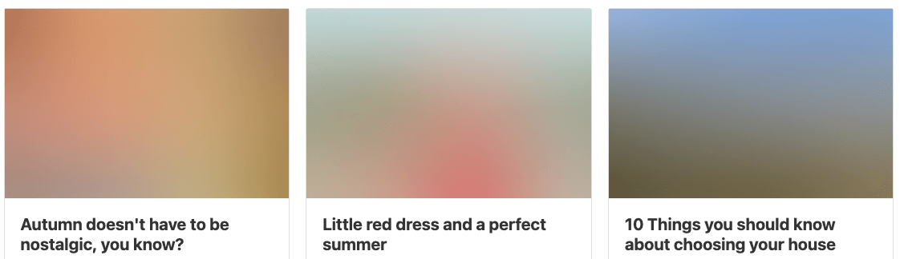

# Lazy Blur Images

Lazy Blur Images is a single-light script that allows developers to implement an async image charge in their websites when they are in the visible area of the user



## How Works

Lazy Blur Images works with base64 images to show a light preview while the real image is downloaded in the background, the image will be downloaded after the "load" event if it is in the visible area, by default the Intersection Observer API is used to detect if the image is in the visible area, if the browser does not support this api, it is downloaded inmediatally after the "load" event

## How to implement

We need to resize our original image to a small image (width of 5px recommended) and [convert it to base64](https://elmah.io/tools/base64-image-encoder/)

```html

<noscript></noscript>
<!-- Before close body -->
<script src="lazy-blur-images.js"></script>
<script>
  lazyBlurData = {
    "some-blur-id": "Your-blur-image-string-in-base64",
  };
  LazyBlurImages.init();
</script>
```

| property         | description                                                | default  |
| ---------------- | ---------------------------------------------------------- | -------- |
| src              | gif 1x1 pixel transparent in base64                        | Manually |
| data-src         | The original image url                                     | Manually |
| data-placeholder | Placeholder type (only blur supported)                     | Manually |
| data-size        | Image size in WxH format ( e.g. 200x500 )                  | Manually |
| data-blur        | The blur key of the lazyBlurData object                    | Manually |
| data-scale       | Custom css transform: scale() used to show the placeholder | 1        |
| data-radio       | Custom css filter: blur() radio in pixels                  | 20       |

The `<noscript>...</noscript>` tags contain the original image, it will be showed if javascript is disabled
